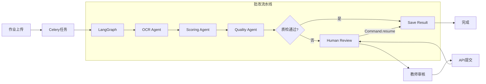

# 智教云 - K12智能教育平台

基于多Agent编排的智能作业批改系统，融合LangGraph工作流、LLM智能评分、HITL人工审核和异步任务队列。

## 核心特性

- **多Agent编排**：基于LangGraph StateGraph，OCR Agent → 评分Agent → 质检Agent 流水线执行
- **HITL人工审核**：低置信度作业自动转人工，教师审核后通过Command(resume)恢复流水线
- **异步任务**：Celery + Redis，作业上传后异步执行批改，支持任务重试和失败恢复
- **智能评分**：LLM驱动（兼容Qwen/DeepSeek），Jinja2模板管理评分Prompt
- **OCR识别**：支持PaddleOCR真实识别和Mock模拟双模式切换
- **学情分析**：ECharts可视化展示学生作业统计和趋势分析

## 技术架构

```
┌─────────────────────────────────────────────────────────────────────────────┐
│                              智教云技术架构                                   │
├─────────────────────────────────────────────────────────────────────────────┤
│                                                                             │
│  ┌─────────────┐     ┌─────────────┐     ┌─────────────┐                   │
│  │   Vue3      │     │  Element    │     │   ECharts   │                   │
│  │  Frontend   │────▶│   Plus      │────▶│ Dashboard   │                   │
│  │   :3000     │     │    UI       │     │             │                   │
│  └──────┬──────┘     └─────────────┘     └─────────────┘                   │
│         │                                                                   │
│         │ HTTP / API                                                        │
│         ▼                                                                   │
│  ┌─────────────────────────────────────────────────────────────────────┐   │
│  │                         FastAPI Backend (:8080)                      │   │
│  │  ┌─────────────┐  ┌─────────────┐  ┌─────────────┐  ┌────────────┐  │   │
│  │  │    Auth     │  │  Homework   │  │ Correction  │  │   Review   │  │   │
│  │  │   Router    │  │   Router    │  │   Router    │  │   Router   │  │   │
│  │  └─────────────┘  └─────────────┘  └─────────────┘  └────────────┘  │   │
│  └─────────────────────────────────────────────────────────────────────┘   │
│         │                                                                   │
│         │ Trigger Async Task                                                │
│         ▼                                                                   │
│  ┌─────────────────────────────────────────────────────────────────────┐   │
│  │                      Celery Worker (Async)                           │   │
│  │                         Redis Broker                                 │   │
│  │  ┌───────────────────────────────────────────────────────────────┐  │   │
│  │  │              LangGraph Correction Pipeline                     │  │   │
│  │  │                                                                │  │   │
│  │  │   ┌──────────┐    ┌──────────┐    ┌──────────┐                │  │   │
│  │  │   │  OCR     │───▶│ Scoring  │───▶│ Quality  │                │  │   │
│  │  │   │  Agent   │    │  Agent   │    │  Agent   │                │  │   │
│  │  │   └──────────┘    └──────────┘    └─────┬────┘                │  │   │
│  │  │                                         │                     │  │   │
│  │  │                    ┌────────────────────┘                     │  │   │
│  │  │                    ▼                                          │  │   │
│  │  │         ┌────────────────────┐                                │  │   │
│  │  │         │   [Condition]      │                                │  │   │
│  │  │         │ needs_manual_review│                                │  │   │
│  │  │         └─────────┬──────────┘                                │  │   │
│  │  │                   │                                           │  │   │
│  │  │         ┌─────────┴──────────┐                                │  │   │
│  │  │         │                    │                                │  │   │
│  │  │         ▼                    ▼                                │  │   │
│  │  │   ┌──────────┐        ┌──────────┐                           │  │   │
│  │  │   │ Human    │        │  Save    │                           │  │   │
│  │  │   │ Review   │───▶    │ Result   │                           │  │   │
│  │  │   │(interrupt│        │          │                           │  │   │
│  │  │   │ before)  │        │          │                           │  │   │
│  │  │   └──────────┘        └──────────┘                           │  │   │
│  │  │                                                                │  │   │
│  │  └───────────────────────────────────────────────────────────────┘  │   │
│  └─────────────────────────────────────────────────────────────────────┘   │
│         │                                                                   │
│         │ Store Results                                                     │
│         ▼                                                                   │
│  ┌─────────────────────────────────────────────────────────────────────┐   │
│  │                         SQLite Database                              │   │
│  │  ┌──────────┐  ┌──────────┐  ┌──────────┐  ┌──────────┐            │   │
│  │  │   User   │  │ Homework │  │Correction│  │  Review  │            │   │
│  │  └──────────┘  └──────────┘  └──────────┘  └──────────┘            │   │
│  └─────────────────────────────────────────────────────────────────────┘   │
│                                                                             │
└─────────────────────────────────────────────────────────────────────────────┘
```

### Agent工作流详解



## 技术栈

| 层级 | 技术 |
|------|------|
| **前端** | Vue3 + Vite + Element Plus + ECharts + Pinia |
| **后端** | FastAPI + SQLAlchemy + Pydantic |
| **AI/ML** | LangGraph + LangChain + LangChain-OpenAI |
| **OCR** | PaddleOCR / Mock双模式 |
| **队列** | Celery + Redis |
| **数据库** | SQLite (开发) / PostgreSQL (生产) |
| **部署** | Docker + Docker Compose |

## 快速启动

### 方式一：Docker Compose（推荐）

```bash
# 1. 克隆项目
git clone <repository-url>
cd k12-education-platform

# 2. 配置环境变量
export LLM_API_KEY=your-deepseek-api-key

# 3. 启动服务
docker-compose up -d

# 4. 查看日志
docker-compose logs -f

# 5. 访问应用
# 前端: http://localhost:3000
# 后端API: http://localhost:8080
# API文档: http://localhost:8080/docs
```

### 方式二：本地开发

**后端启动：**
```bash
cd backend

# 创建虚拟环境
python -m venv venv
source venv/bin/activate  # Windows: venv\Scripts\activate

# 安装依赖
pip install -r requirements.txt

# 启动Redis
docker run -d -p 6379:6379 redis:7-alpine

# 启动Celery Worker
celery -A app.tasks.celery_app worker --loglevel=info

# 启动FastAPI
python main.py
```

**前端启动：**
```bash
cd frontend

# 安装依赖
npm install

# 启动开发服务器
npm run dev

# 访问: http://localhost:3000
```

## 项目结构

```
.
├── backend/                    # FastAPI后端
│   ├── app/
│   │   ├── agents/            # LangGraph Agent编排
│   │   │   ├── state.py       # 共享State定义
│   │   │   ├── ocr_agent.py   # OCR识别Agent
│   │   │   ├── scoring_agent.py # LLM评分Agent
│   │   │   ├── quality_agent.py # 质检Agent
│   │   │   ├── router.py      # 条件路由
│   │   │   ├── graph.py       # StateGraph组装
│   │   │   └── prompts/       # Jinja2 Prompt模板
│   │   ├── api/               # API路由
│   │   ├── core/              # 配置文件
│   │   ├── db/                # 数据库
│   │   ├── models/            # SQLAlchemy模型
│   │   ├── schemas/           # Pydantic模型
│   │   ├── services/          # 业务服务
│   │   │   ├── ocr_service.py # OCR服务（PaddleOCR/Mock）
│   │   │   └── ocr_mock_data.py # 模拟数据
│   │   ├── tasks/             # Celery异步任务
│   │   └── utils/             # 工具函数
│   ├── uploads/               # 上传文件目录
│   ├── main.py                # 应用入口
│   ├── Dockerfile             # 后端Dockerfile
│   └── requirements.txt       # Python依赖
│
├── frontend/                   # Vue3前端
│   ├── src/
│   │   ├── api/               # API接口
│   │   ├── components/        # 公共组件
│   │   ├── views/             # 页面视图
│   │   │   ├── student/       # 学生端
│   │   │   ├── teacher/       # 教师端
│   │   │   └── admin/         # 管理端
│   │   ├── router/            # 路由配置
│   │   └── store/             # Pinia状态管理
│   ├── Dockerfile             # 前端Dockerfile
│   └── nginx.conf             # Nginx配置
│
├── docker-compose.yml         # Docker编排配置
└── README.md                  # 项目说明
```

## 配置说明

### 环境变量

| 变量名 | 说明 | 默认值 |
|--------|------|--------|
| `OCR_ENGINE` | OCR引擎类型 | `mock` (可选: `paddleocr`) |
| `PADDLEOCR_USE_GPU` | 是否使用GPU | `false` |
| `LLM_BASE_URL` | LLM API地址 | `https://api.deepseek.com/v1` |
| `LLM_API_KEY` | LLM API密钥 | 必填 |
| `LLM_MODEL_NAME` | LLM模型名称 | `deepseek-chat` |
| `REDIS_URL` | Redis连接地址 | `redis://localhost:6379/0` |
| `MANUAL_REVIEW_THRESHOLD` | 人工审核阈值 | `0.70` |

### 配置文件

```bash
# backend/.env
OCR_ENGINE=mock
LLM_BASE_URL=https://api.deepseek.com/v1
LLM_API_KEY=your-api-key
LLM_MODEL_NAME=deepseek-chat
REDIS_URL=redis://localhost:6379/0
```

## 使用指南

### 1. 学生上传作业

1. 登录学生账号（默认: student1 / 123456）
2. 进入"上传作业"页面
3. 选择学科、填写标题、上传图片
4. 提交后作业进入"批改中"状态
5. 可在"我的作业"页面查看批改进度

### 2. 系统自动批改流程

```
作业上传 → Celery异步任务 → LangGraph流水线
                                    ↓
            ┌───────────────────────┼───────────────────────┐
            ↓                       ↓                       ↓
        OCR Agent              Scoring Agent           Quality Agent
        (文字识别)              (LLM智能评分)            (质量检查)
                                    ↓
                          质检通过? ──┬── 是 → 保存结果
                                    │
                                    └── 否 → 转人工审核
```

### 3. 教师人工审核

1. 登录教师账号（默认: teacher1 / 123456）
2. 进入"人工审核"页面
3. 查看OCR识别结果和置信度
4. 填写评分和评语
5. 提交后自动恢复LangGraph流水线

### 4. 查看学情分析

- 学生：查看个人作业统计和得分趋势
- 教师：查看班级整体学情和错题分析
- 管理员：查看全平台数据大盘

## API文档

启动服务后访问：
- Swagger UI: http://localhost:8080/docs
- ReDoc: http://localhost:8080/redoc

### 核心API

| 接口 | 方法 | 说明 |
|------|------|------|
| `/api/v1/auth/login` | POST | 用户登录 |
| `/api/v1/homework/upload` | POST | 上传作业 |
| `/api/v1/homework/my` | GET | 获取我的作业 |
| `/api/v1/corrections/` | GET | 获取批改列表 |
| `/api/v1/reviews/{id}/review` | POST | 提交人工审核 |
| `/api/v1/dashboard/stats` | GET | 学情统计数据 |

## 开发指南

### 添加新的Agent节点

1. 在 `app/agents/` 创建新的Agent文件
2. 实现Agent函数，接收 `CorrectionState` 返回更新字典
3. 在 `graph.py` 中添加节点和边
4. 更新路由逻辑（如需要）

### 修改评分Prompt

编辑 `app/agents/prompts/scoring_prompt.j2`：

```jinja2
你是一位K12教育领域的专业教师，正在批改学生的{{subject}}作业。

学科：{{subject}}
OCR识别内容：
{{ocr_text}}

评分要求...
```

### 切换OCR引擎

```bash
# Mock模式（无需安装PaddleOCR）
export OCR_ENGINE=mock

# PaddleOCR模式（需先安装依赖）
pip install paddlepaddle paddleocr
export OCR_ENGINE=paddleocr
```

## 部署建议

### 生产环境

1. **数据库**: 将SQLite替换为PostgreSQL
2. **缓存**: 配置Redis集群
3. **文件存储**: 使用对象存储（OSS/S3）
4. **LLM**: 使用私有化部署或高可用API
5. **监控**: 集成Prometheus + Grafana

### 性能优化

- 启用Celery任务结果后端持久化
- 配置Redis连接池
- 使用CDN加速静态资源
- 数据库索引优化

## 许可证

MIT License

## 联系方式

- 项目地址: [GitHub Repository]
- 问题反馈: [Issues]
- 邮箱: contact@zhijiaoyun.com

---

**智教云** - 让AI赋能教育，让批改更智能！
